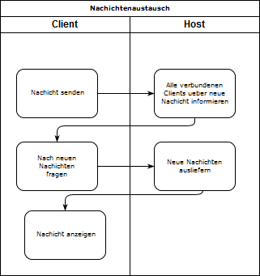
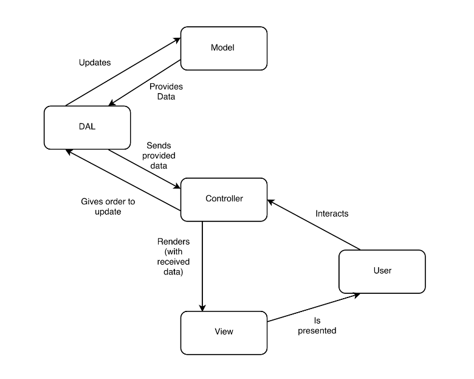

# Dokumentation
Philipp Zülicke, 571000

Pascal Wegner, 571502

Frank Hasenbalg, 571087

## WpfApplication1

### Interfaces
Die WPF Anwendung besitzt eine Servicereferenz auf den ServiceContract 'IChatService' und die DataContracts UserData und EventData.
Der ServiceContract repraesentiert die Faehigkeiten des Service-Hosts, die DataContracts definieren das Datenmodell.

Die WPF Anwendung implementiert 'IChatClient'. Dort werden die Callback-Funktionen fuer den Client festgelegt.

### GUI
Um Input-Felder wie 'DateTimePicker' und 'ColorPicker' benutzen zu koennen, habe ich eine Referenz auf Xceeds WPF Toolkit hinzugefuegt.

#### Extensions:
- Xceed.Wpf.Toolkit,  [https://github.com/xceedsoftware/wpftoolkit](https://github.com/xceedsoftware/wpftoolkit), 20.08.2017

## Host
Der Host hat eine Referenz auf System.ServiceModel. In 'Program' wird von dort eine Instanz von ServiceHost erzeugt, die vom Typ 'ChatService' ist. So werden alle dort definierten Funktionen und Datenmodelle vom Host angeboten.
Indirekt wird ueber den Callback-Contract in 'IChatService' auch 'IChatClient' publiziert.

Weitere wichtige Referenzen im Host sind die auf DAL, Model und das EntityFramework, um die in der Webanwendung bestehende Datenbankmodelle nutzten zu koennen.

### Callbacks
Durch die Verwendung von Callbacks auf dem Client muessen die Clients nicht in Intervallen fragen, ob es neue Informationen gibt. So werden der Service und die Clients entlastet.

### Transparenz
Der ServiceHost bietet CRUD-Funktionalitaet fuer seine DataContracts an. Die DataContracts ensprechen weitestgehend den Datenbankmodellen.

### Interaktion zwischen Host und Windows Client
Findet beim Client ein Event statt, der die Benachichtigug der anderen Clients erfordert, wie z.B. das Absenden einer neuen Chatnachicht, veranlasst der Host ueber einen Callback-Kanal, dass alle Clients beim Host nach Updates fragen.
Analog wird mit Login, Logout und mit neuen/ geaenderten/ geloeschten Kalendereintraegen verfahren.

### Quellen
#### Einfuehrungsliteratur
Basic WCF Programming, Erik Reitan, Luke Latham u.a, https://docs.microsoft.com/en-us/dotnet/framework/wcf/basic-wcf-programming, 22.09.2017

Deploying a WPF Application (WPF), Luke Latham, Bill Wagner u.a, https://docs.microsoft.com/en-us/dotnet/framework/wpf/app-development/deploying-a-wpf-application-wpf, 22.09.2017

#### URL-Referenzen aus dem Quellcode
WPF ListView with buttons on each line, Fredrik Hedblad, https://stackoverflow.com/a/7128002, 22.09.2017

Window.Closing Event, https://msdn.microsoft.com/en-us/library/system.windows.window.closing(v=vs.110).aspx, 22.09.2017

How do I access the UI thread for my WCF subscriber?, Parapura Rajkumar, https://stackoverflow.com/a/8207299, 22.09.2017

## Webkalender
Auf der Suche nach einem passenden Kalender, sind wir auf den Kalender https://fullcalendar.io/ gestoßen und haben diesen aufgrund seiner vielfältigen Features und passender Adaption an Bootstrap gewählt.
Die Implementierung erfolgte über JQuery in Kombination mit dem Modal von Bootstrap als Dialog direkt in der Index-View des HomeControllers.
Durch den Import der Bibliothek hatten wir schon das Grundgerüst und mussten nur noch unser DbModel einbinden. Um auf unsere Datenbank zuzugreifen wird ein AJAX-Request an die HomeController GetEvents-Action gesendet, der ein JSON mit einer gemappten List des EntitySet zurückliefert.
Im Script wird dann jedes Event in ein JS-Array gemappt, damit die Daten mit der Bibliothek interagieren können. Das Array wird dann dem "events"-Feld des Kalender zugewiesen und schon werden alle Events gerendert.

Da der Kalender das Hauptfeature unserer Applikation ist, haben wir auf einen herkömmlichen Home-Bereich verzichtet und zeigen den Kalender auf unserer Home-Page an.
Wenn man nicht eingeloggt ist, sieht man den Kalender zwar, jedoch kann man nicht mit ihm interagieren.

